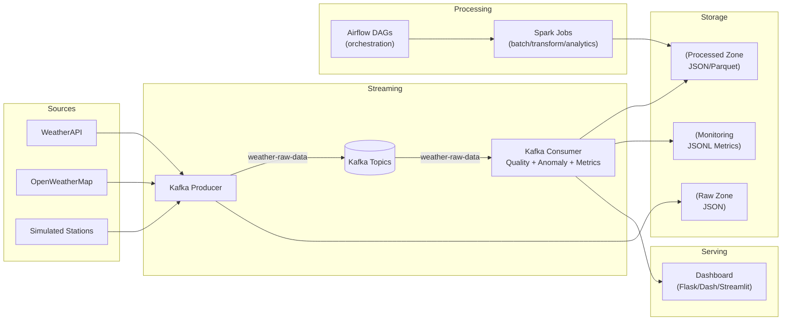

### ***WeatherFlow — Real-Time Weather Data Engineering + Streaming Anomaly Detection***

[](https://www.python.org/)


WeatherFlow is an end-to-end **real-time data engineering pipeline** that ingests multi-source weather data, streams it through Kafka, performs **online data quality monitoring** and **real-time anomaly detection**, and persists curated outputs for analytics and dashboards. It is intentionally designed to look and feel like a research-grade system: configurable, measurable, and extendable toward ML on streaming data.

## Problem Statement

Weather is a naturally streaming, non-stationary phenomenon: distributions drift by season, geography, and extreme events. A robust real-time pipeline must therefore:

- **Ingest heterogeneous sources** (multiple APIs, potentially different schemas and update frequencies)
- **Validate and monitor data quality** continuously (missing values, schema drift, physically implausible measurements)
- **Detect anomalies in real time** (sensor errors, sudden spikes/drops, extreme weather)
- **Operate reliably at scale** (backpressure, retries, metrics, reproducibility)

These are the same core engineering + modeling problems seen in other high-stakes streaming domains (e.g., fraud detection, network security, industrial IoT).

## Architecture (Diagram + Data Flow)

Mermaid architecture diagram (rendered by GitHub):



## Tech Stack (What Each Piece Does)

- **Python**: producers/consumers, utility scripts, data validation and anomaly logic
- **Apache Kafka**: durable, scalable event log (raw + processed topics)
- **Apache Spark**: transformation and analytics at scale (batch jobs / structured processing)
- **Apache Airflow**: orchestration, scheduling, and observable DAG execution
- **Docker Compose**: reproducible local environment (Kafka, Spark, Airflow, dashboard)
- **JSON/Parquet**: raw zone for traceability; parquet for analytics efficiency

## Project Structure

```
.
├── WeatherFlow-DataEngineering-main/
│   ├── weather_flow/
│   │   ├── config.yaml                  # Single source of truth for parameters
│   │   ├── airflow/                     # Airflow DAGs
│   │   ├── docker/                      # Docker + Compose
│   │   ├── kafka/scripts/               # Producer/consumer + monitoring utilities
│   │   ├── scripts/                     # API ingestion + quality/anomaly/metrics modules
│   │   ├── spark/                       # Spark jobs
│   │   ├── dashboard/                   # UI layer
│   │   ├── data/                        # raw/processed/monitoring outputs
│   │   └── requirements.txt
│   ├── PROBLEM_STATEMENT.md
│   ├── IMPLEMENTATION.md
│   └── Readme_Academic_integrity/
├── docs/
└── README.md
```

## Configuration (No Hardcoded Values)

All parameters (topics, paths, thresholds, city list, anomaly settings) live in:

- `WeatherFlow-DataEngineering-main/weather_flow/config.yaml`

Secrets are injected via environment variables (recommended for Docker):

- `WEATHERAPI_KEY`
- `OPENWEATHER_API_KEY`

Optional overrides:

- `WEATHERFLOW_CONFIG_PATH`: path to a custom config file
- `KAFKA_BOOTSTRAP_SERVERS`: comma-separated list
- `WEATHERFLOW_INGESTION_INTERVAL_SECONDS`: producer interval

## Setup & Run (Docker — Recommended)

### Prerequisites

- Docker + Docker Compose
- API keys for at least one source (WeatherAPI and/or OpenWeatherMap)

### 1) Create environment file

From `WeatherFlow-DataEngineering-main/weather_flow/`, create a `.env` file (do **not** commit it):

```bash
WEATHERAPI_KEY=...your_key...
OPENWEATHER_API_KEY=...your_key...
```

### 2) Start the full stack

```bash
cd WeatherFlow-DataEngineering-main/weather_flow/docker
docker compose up -d --build
```

### 3) Useful UIs

- **Dashboard**: `http://localhost:8051`
- **Airflow UI**: `http://localhost:8091` (admin/admin)
- **Kafka UI (Kafdrop)**: `http://localhost:9000`
- **Spark Master UI**: `http://localhost:8081`

### 4) Where outputs land

- **Processed events**: `WeatherFlow-DataEngineering-main/weather_flow/data/processed/`
- **Monitoring logs (JSONL)**: `WeatherFlow-DataEngineering-main/weather_flow/data/monitoring/`
  - `stream_metrics.jsonl`: throughput + latency windows
  - `data_quality_events.jsonl`: missing fields / bounds violations
  - `anomaly_events.jsonl`: anomaly detections + scores

## Run Locally (Without Docker)

```bash
cd WeatherFlow-DataEngineering-main/weather_flow
python -m venv .venv
source .venv/bin/activate  # (Windows: .venv\\Scripts\\activate)
pip install -r requirements.txt

# Fetch some raw events
python scripts/weather_api.py

# (Optional) Run Spark batch processor
python scripts/spark_weather_processor.py --input data/raw --output data/processed
```

## Screenshots / Outputs (Placeholder)

- **Kafka UI (Kafdrop)**: _add screenshot here_
- **Dashboard**: _add screenshot here_
- **Sample metrics JSONL**: _add snippet here_
- **Sample anomaly event JSONL**: _add snippet here_

## Results (Metrics + Evidence)

WeatherFlow logs streaming metrics in `WeatherFlow-DataEngineering-main/weather_flow/data/monitoring/stream_metrics.jsonl` as JSON Lines. Each record includes:

- throughput in **messages/sec**
- average end-to-end latency in **ms** (based on event timestamps)

### How to Report Numbers (Recommended for a PhD application)

Run the pipeline for \( \ge 10 \) minutes and report:

- **Throughput**: median + p95 messages/sec across windows
- **Latency**: median + p95 end-to-end latency (ms)
- **Data volume**: events processed + bytes written to raw/processed/monitoring zones

Suggested table (fill with your measured values):

| Setting | Value |
|---|---:|
| Producer interval | `config.yaml: ingestion.interval_seconds` |
| Events processed | _TODO_ |
| Median throughput (msg/s) | _TODO_ |
| P95 throughput (msg/s) | _TODO_ |
| Median E2E latency (ms) | _TODO_ |
| P95 E2E latency (ms) | _TODO_ |
| Raw zone size | _TODO_ |
| Processed zone size | _TODO_ |

## Research Relevance (Streaming → Fraud Detection)

Although WeatherFlow is built on weather data, the core technical contributions map directly to **fraud detection on financial transaction streams**:

- **Streaming data processing**: Kafka topics + consumer processing mirrors transaction ingestion and enrichment pipelines.
- **Real-time anomaly detection**: rolling z-scores / Isolation Forest correspond to online fraud scoring and outlier detection under concept drift.
- **Scalable pipelines**: config-driven components, monitoring logs, and reproducible deployments mirror production MLOps constraints in fintech.

In both domains, the engineering challenge is the same: **reliable low-latency decisioning on high-velocity, noisy, evolving event streams**.

## Future Work (Toward ML + Publication-Ready Extensions)

- **Online learning + drift detection**: ADWIN/Page-Hinkley, seasonal baselines per city, and drift-aware thresholding.
- **Feature engineering on streams**: lag features, rolling aggregates, regime-aware statistics.
- **Probabilistic anomaly detection**: Bayesian change-point detection; EVT-based tail modeling for extremes.
- **Active learning loop**: human-in-the-loop labeling of anomalies to train supervised models.
- **Unified monitoring**: export Prometheus metrics + Grafana dashboards; alerting on quality/anomaly rates.
- **Fraud-stream analog**: replay the same pipeline on a public transaction dataset (e.g., credit-card fraud) to demonstrate domain transfer.

